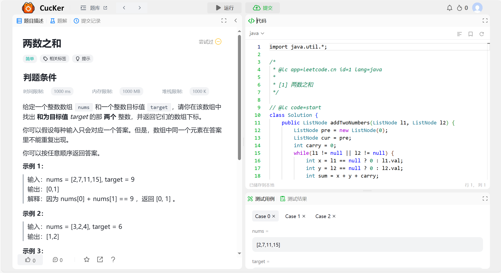
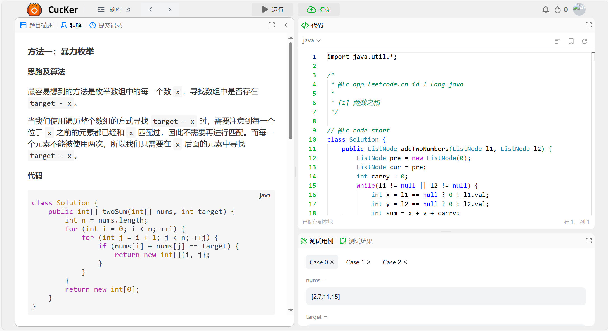
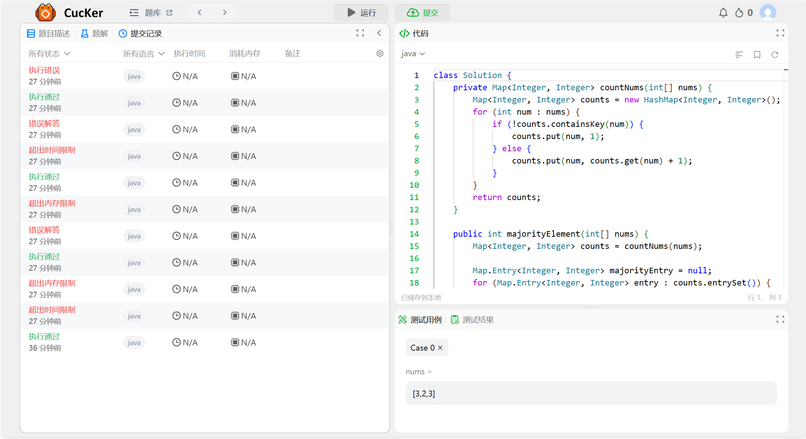
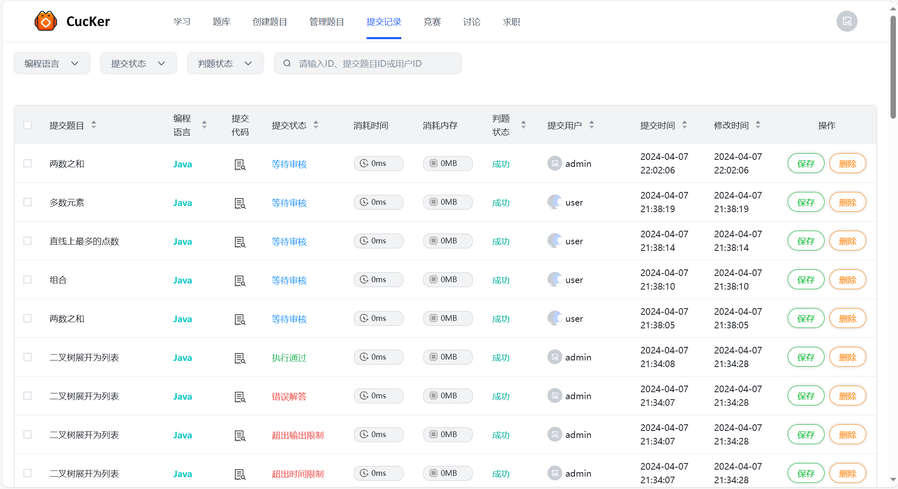

### 酷客 CucKer 编程代码测评系统

本项目是一个基于 Vue.js 和 Spring Boot 构建的在线编程学习和评测平台。用户在此平台浏览和作答题目，提交题目作答内容后等待管理员审核给出判题结果。

1. 用户体验：通过简易的注册和登录流程，用户可轻松访问平台，并选择感兴趣的编程题目进行练习。
2. 题目管理和判题：管理员具备发布、修改、删除题目的权限，对用户提交的题目作答情况进行人工判题。

### 项目介绍

基于 Vue3+Spring Boot 构建的前后端分离在线编程学习和评测平台，采用单体应用服务架构。

后端项目地址：https://github.com/Theodorix/lxmoj-backend

前端项目地址：https://github.com/Theodorix/lxmoj-frontend

### 运行项目

1. 安装环境：

    ```bash
    yarn
    ```

2. 前后端联调

    ```bash
    openapi --input http://localhost:8121/api/v2/api-docs --output ./generated --client axios
    ```

3. 启动项目

    ```bash
    yarn serve
    ```

### 项目截图

> 系统首页


> 注册登录页


> 题库页面


> 题目详情页面



> 题目题解页面



> 题目提交记录



> 管理题目页面


> 管理提交记录页面




